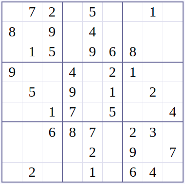
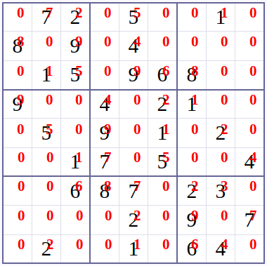
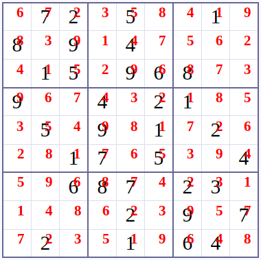
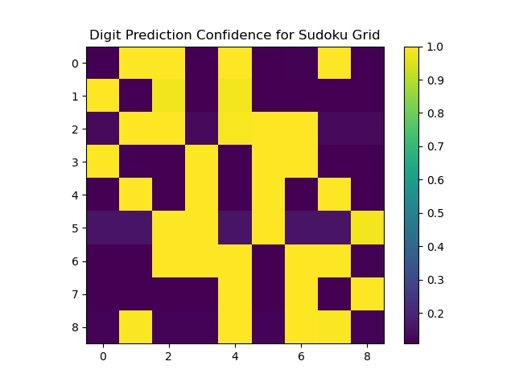

<h1 style="text-align: center;">
Sudoku Solver
</h1>

This project's aim was to provide a general and automated method to solve sudoku puzzles. This is accomplished using
image processing techniques, machine learning, and a graphical user interface (GUI) for user feedback. Briefly, I will
describe how to install the project. Then I will delve deep into the methodology on how I set up the problem and how I
went about solving it. Finally, I will describe how to use the GUI. However, before I go any deeper, here is an example
demonstrating the power of my automated sudoku solver.


<div align="center">


<p align="center">
    The left image is an untouched sudoku puzzle. The right image is the display after it has established the initial conditions.
</p>
</div>

<div align="center">

<p align="center"> This is the display showing a solution for the puzzle. </p>
</div>

## Installation:

To download the repository using the Linux command line:

```commandline
git clone https://github.com/myklmaring/sudoku_solver.git
```

Otherwise, click the green "Code" button in the top right, and select "Download ZIP".

### Conda Environment

I have included a conda environment **(sudoku_env.yml)** that contains all the required python packages and package
versions to run the program. If you do not have conda install already, you can download a stripped-down version of it
called Miniconda [here](https://docs.conda.io/en/latest/miniconda.html).

To set up the environment, open the command line and navigate to the sudoku solver directory you downloaded on your
computer and type:

```commandline
conda env create -f sudoku_env.yml
```

This will create a conda environment on your system named "sudoku". Now, to start this environment on your system, you
will need to type the following in the command line:

```commandline
conda activate sudoku
```

Now you are ready to run the program! In the command line, start the GUI by typing:

```commandline
python main.py
```

From here, follow the How To section to start automatically solving sudoku puzzles on your own!

## How to Run/Use the Program:

1. In the File menu tab open sudoku image using the **Open** action (Ctrl+O).
2. In the Actions menu tab select the **Find Corners** action (Ctrl+C). Left mouse click on the corners of
   "the sudoku puzzle in order from top left, top right, bottom left, bottom right"
3. In the Actions menu tab select the **Determine Digits** action (Ctrl+D). This will automatically determine
   "which digits are in the cell, if any. Emtpy cells will be denoted with a zero. Left mouse click sudoku
   "cell to increment the prediction for the cell. Right mouse click to return to the previous prediction.
   (Optional) In the Actions menu tab select Toggle Number Display (Ctrl+X) to stop/start displaying digits
4. In the Actions menu tab select **Solve Sudoku Puzzle** (Ctrl+Z) to solve for the missing numbers. It will
   automatically display the correct digits in their corresponding locations if the solve was successful. Otherwise, a
   message will pop up in the status bar at the bottom letting you know that the solve failed; prompting you to go alter
   the initial conditions so that they are all correct.

This information is accessible from within the GUI if you press on the help tab and select the "Use Instructions" action

There are example puzzles included in the **puzzles** folder that you can test this on, but feel free to try your own.
Just be aware that this program can run into issues if the background of the puzzle is not one single color, or if the
number in each cell does not take up the majority of the cell.

## Methodology:

I promise to go more in-depth at a later date, but I still need to gather/create images to make proper figures.

In short, the process follows the follow scheme which I have separated into image processing and problem solving.

### Image processing

1. Four point affine transformations using the corner points of the sudoku box selected by the user
2. Gaussian filtering to remove noise
3. Reshaping image into 81 separate images (9x9 cells) and cropping to remove sudoku cell borders
4. Rescaling pixel values to lie between 0-255 and ensuring images are black background w/ white digit
5. Centering digit in the image using pixel center of mass
6. Pass each image through a convolutional neural network trained on the MNIST dataset
7. The prediction for a filled sudoku cell is selected by the digit with the maximum prediction confidence. Empty cells
   contain low prediction confidences for all digits and are filtered out using a predefined threshold.

<div align="center">


<p align="center">
    The left image is an untouched sudoku puzzle. The right image is the maximum prediction confidence for each cell
    Notice how the maximum prediction confidence for empty sudoku cells is noticeable lower than filled cells.
</div>

### Problem Solving

The sudoku problem set-up in the image processing steps is then solved using a linear programming solver. Briefly,
linear programming is an optimization technique that finds a solution(s) to an objective function and requires linear
constraints. For this particular problem, we just want a solution. If there are multiple solutions, we don't can which
one it may be. Therefore, the objective function can be set to an arbitrary constant value (i.e. zero).

Here are the rules for a sudoku puzzle:

1. There can only be one number is each box
2. The numbers 1-9 must only appear once in each row
3. The numbers 1-9 must only appear once in each col
4. The numbers 1-9 must only appear once in each box

We can implement these rules as linear constraints if we alter the puzzle slightly. To do this, we will extend the
puzzle into a 3rd dimension. Think of the puzzle as a cube instead of a square. In this newly added dimension, the index
corresponding to the correct number will be one and all other values zero. Each of these cube spaces is a variable that
can take either the value zero or one.

According to rule number (1), we know that if I add the variables in the third dimension for the top-left most sudoku
cell together it should be equal to exactly one!  This can be repeated with each sudoku cell extending into the third
dimension.

Similarly, If I look at the top-most row at the first depth location only one of those variables should be equal to one.
Thus, if I sum those variables it should be equal to 1!  This can be repeated for each row and depth permutation, and
formulates the linear constraints for rule (2). Now I won't belabor this because this readme already contains a load of
text, but this process can be repeated for rules (3) and (4). In the end we have our objective function and our linear
constraints that follow the rules defining the sudoku puzzle problem.

I do not take credit for this ingenious formulation. Some very smart people thought of this; all I did was create my own
unique linear programming code implementation.

For a more in-depth explanation about this process check out this case
study [here](https://coin-or.github.io/pulp/CaseStudies/a_sudoku_problem.html)

## Future Goals

1) Implement a solver using [backtracking](https://en.wikipedia.org/wiki/Backtracking).
2) Implement a method to automatically locate the puzzle. My idea would be to identify and locate digits
   simultaneously using something like in [YOLO](https://arxiv.org/pdf/1506.02640.pdf)
